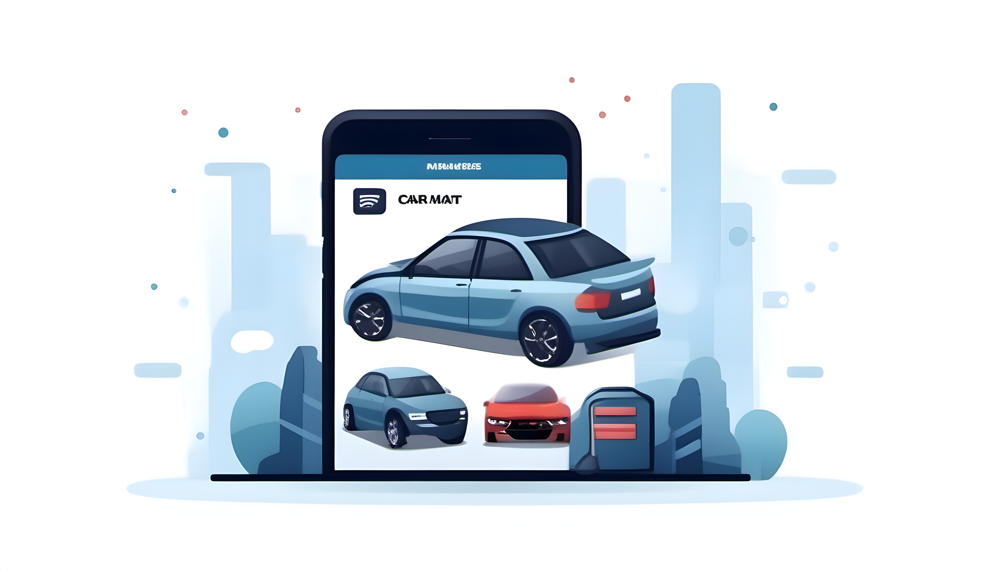

## Ghana Ahmada Yudistira (2206824760 - PBP B)



## Tugas 7

### 1. Apa perbedaan utama antara stateless dan stateful widget dalam konteks pengembangan aplikasi Flutter?

**Stateless Widget** adalah tipe widget yang tetap tidak berubah setelah dibuat. Dalam konteks ini, setelah suatu Stateless Widget menggambarkan data tertentu, widget tersebut tidak dapat mengubah data tersebut atau melakukan perubahan pada dirinya sendiri berdasarkan perubahan data. Penggunaan Stateless Widget tepat ketika komponen atau tampilan tidak membutuhkan pembaruan berdasarkan perubahan data. Stateless Widget memiliki keunggulan dalam efisiensinya karena tidak menyimpan informasi status (state) internal.

Contoh penggunaan Stateless Widget terjadi ketika sebuah widget hanya menampilkan teks statis atau gambar yang tidak mengalami perubahan, tanpa ada kebutuhan untuk mengubahnya berdasarkan masukan atau interaksi pengguna.

Di sisi lain, **Stateful Widget** adalah tipe widget yang dapat mengalami perubahan dan memperbarui tampilannya berdasarkan perubahan data atau respons terhadap interaksi pengguna. Stateful Widget sangat berguna ketika suatu komponen memerlukan pembaruan yang dinamis sehubungan dengan input, respons terhadap tindakan pengguna, atau perubahan data eksternal. Widget ini memungkinkan perubahan dalam tampilan dan memperbarui ulang widget ketika terjadi perubahan pada data yang terkait.

Sebagai contoh penggunaan Stateful Widget, Anda dapat membayangkan sebuah formulir pengguna yang mengubah tampilan berdasarkan input yang diberikan oleh pengguna, atau sebuah daftar item yang perlu diperbarui secara dinamis berdasarkan perubahan data yang diterima dari sumber eksternal. Dalam kedua contoh tersebut, Stateful Widget memungkinkan pengembang untuk mengelola dan menanggapi perubahan dengan fleksibilitas, memastikan bahwa tampilan aplikasi selalu up-to-date dan sesuai dengan data yang relevan.

### 2. Sebutkan seluruh widget yang kamu gunakan untuk menyelesaikan tugas ini dan jelaskan fungsinya masing-masing.

Di dalam berkas `main.dart`, aplikasi Flutter dibangun menggunakan `MaterialApp` sebagai landasan utama. `MaterialApp` bertanggung jawab mengatur tema dan navigasi global aplikasi. `ThemeData` digunakan untuk memberikan tema yang seragam di seluruh aplikasi. `ColorScheme.fromSeed` digunakan untuk menghasilkan skema warna berdasarkan warna benih yang diberikan. Hal ini menciptakan tampilan yang konsisten dan estetis secara visual.

`AppBarTheme` secara spesifik mengonfigurasi tampilan `AppBar` di seluruh aplikasi dengan menetapkan latar belakang (background color) menjadi warna indigo yang sama dengan tema keseluruhan. Widget utama aplikasi, `MyApp`, menggambarkan inti dari aplikasi. Itu mengarahkan pengguna ke `MyHomePage`, yang berfungsi sebagai halaman utama. `MyHomePage` adalah widget stateless yang menggunakan `Scaffold` sebagai kerangka dasar. Di dalam `Scaffold`, digunakan `GridView.count` untuk membuat tata letak grid yang menampung elemen-elemen seperti `ShopCard`. `ShopCard` adalah representasi visual dari `ShopItem`, dengan judul dan ikon.

Setiap `ShopCard` diinteraksikan dengan pengguna dan dibungkus dalam `Material` dan `InkWell` untuk memberikan efek visual dan umpan balik saat disentuh. Ketika diklik, `ShopCard` menampilkan `SnackBar` sebagai respons. Widget lain seperti `Column` dan `Padding` digunakan untuk menyusun dan memberikan ruang antar elemen-elemen. `Container`, `Center`, `Icon`, dan `Text` digunakan untuk menampilkan informasi dan ikonografi dengan cara yang estetis dan memberikan fokus pada pengalaman pengguna.


### 3. Implementasi

#### Membuat program Flutter baru dengan tema *inventory*
Masuk ke direktori tugas dan jalankan command 
```sh
flutter create car_mart_mobile

cd car_mart_mobile

flutter run
```
Base program flutter bernama `car_mart_mobile` sudah terbuat dan bisa langsung dimodifikasi sesuai keinginan.

#### Membuat tiga tombol sederhana dengan ikon dan teks
1. Buat berkas Dart baru dengan nama menu.dart dalam direktori lib.

2. Pada awal berkas menu.dart, tambahkan baris kode import 'package:flutter/material.dart'; untuk mengimpor paket Material Design, yang menyediakan berbagai widget yang digunakan dalam aplikasi Flutter.

3. Pindahkan kelas MyHomePage dari berkas main.dart ke dalam berkas menu.dart. Kelas MyHomePage ini akan bertanggung jawab untuk menampilkan tampilan utama dari aplikasi.

4. Hapus kelas _MyHomePageState karena pada tahap ini kita akan membuat widget yang tidak memiliki status (stateless).

5. Buat kelas `ShopItem` dan `ShopCard` untuk membuat tombol dan snackbar yang dibutuhkan
    ```java
    class ShopItem {
    final String name;
    final IconData icon;
    final Color color;

    ShopItem(this.name, this.icon, this.color);
    }

    class ShopCard extends StatelessWidget {  //CLASS SHOPCARD
        final ShopItem item;

        const ShopCard(this.item, {super.key}); // Constructor

        @override
        Widget build(BuildContext context) {
            return Material(
            color: item.color,
            child: InkWell(
                // Area responsive terhadap sentuhan
                onTap: () {
                // Memunculkan SnackBar ketika diklik
                ScaffoldMessenger.of(context)
                    ..hideCurrentSnackBar()
                    ..showSnackBar(SnackBar(
                        content: Text("Kamu telah menekan tombol ${item.name}!")));
                },
                child: Container(
                // Container untuk menyimpan Icon dan Text
                padding: const EdgeInsets.all(8),
                child: Center(
                    child: Column(
                    mainAxisAlignment: MainAxisAlignment.center,
                    children: [
                        Icon(
                        item.icon,
                        color: Colors.white,
                        size: 30.0,
                        ),
                        const Padding(padding: EdgeInsets.all(3)),
                        Text(
                        item.name,
                        textAlign: TextAlign.center,
                        style: const TextStyle(color: Colors.white),
                        ),
                    ],
                    ),
                ),
                ),
            ),
            );
        }
        
    }
    ```
6. Modifikasi `MyHomePage` untuk menampilkan tiga tombol yang dibutuhkan

    ```java
    class MyHomePage extends StatelessWidget {
        MyHomePage({Key? key}) : super(key: key);
        final List<ShopItem> items = [
        ShopItem("Lihat Item", Icons.checklist, Color(0xFF006CA5)),
        ShopItem("Tambah Item", Icons.add_shopping_cart, Color(0xFF0496C7)),
        ShopItem("Logout", Icons.logout, Color(0xFF04BADE)),
    ];

        @override
        Widget build(BuildContext context) {
            // This method is rerun every time setState is called, for instance as done
            // by the _incrementCounter method above.
            //
            // The Flutter framework has been optimized to make rerunning build methods
            // fast, so that you can just rebuild anything that needs updating rather
            // than having to individually change instances of widgets.
            return Scaffold(
            appBar: AppBar(
                title: const Text(
                'Libshop',
                ),
            ),
            body: SingleChildScrollView(
                // Widget wrapper yang dapat discroll
                child: Padding(
                padding: const EdgeInsets.all(10.0), // Set padding dari halaman
                child: Column(
                    // Widget untuk menampilkan children secara vertikal
                    children: <Widget>[
                    const Padding(
                        padding: EdgeInsets.only(top: 10.0, bottom: 10.0),
                        // Widget Text untuk menampilkan tulisan dengan alignment center dan style yang sesuai
                        child: Text(
                        'Library Shop', // Text yang menandakan toko
                        textAlign: TextAlign.center,
                        style: TextStyle(
                            fontSize: 30,
                            fontWeight: FontWeight.bold,
                        ),
                        ),
                    ),
                    // Grid layout
                    GridView.count(
                        // Container pada card kita.
                        primary: true,
                        padding: const EdgeInsets.all(20),
                        crossAxisSpacing: 10,
                        mainAxisSpacing: 10,
                        crossAxisCount: 3,
                        shrinkWrap: true,
                        children: items.map((ShopItem item) {
                        // Iterasi untuk setiap item
                        return ShopCard(item);
                        }).toList(),
                    ),
                    ],
                ),
                ),
            ),
            );
        }
        }
    ```

#### Memunculkan Snackbar dengan tulisan sesuai widget yang diklik
Menambahkan widget `InkWell` yang menampilkan ikon dan teks dari `item` saat ditekan. Saat tombol ditekan, kode memunculkan Snackbar dengan pesan `"Kamu telah menekan tombol [nama item]!"`.

```java
...
child: InkWell(
        // Area responsive terhadap sentuhan
        onTap: () {
          // Memunculkan SnackBar ketika diklik
          ScaffoldMessenger.of(context)
            ..hideCurrentSnackBar()
            ..showSnackBar(SnackBar(
                content: Text("Kamu telah menekan tombol ${item.name}!")));
        },
        child: Container(
          // Container untuk menyimpan Icon dan Text
          padding: const EdgeInsets.all(8),
          child: Center(
            child: Column(
              mainAxisAlignment: MainAxisAlignment.center,
              children: [
                Icon(
                  item.icon,
                  color: Colors.white,
                  size: 30.0,
                ),
                const Padding(padding: EdgeInsets.all(3)),
                Text(
                  item.name,
                  textAlign: TextAlign.center,
                  style: const TextStyle(color: Colors.white),
                ),
              ],
            ),
          ),
        ),
      ),
...
```
